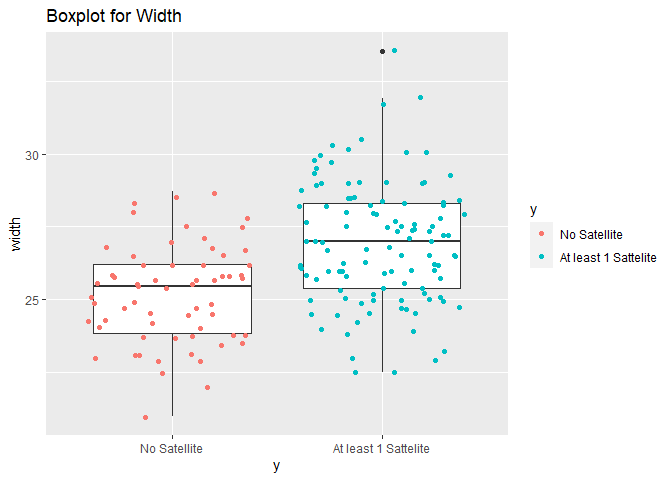

Horseshoe Crab: An Exploratory Data Analysis
================
Chien-Lan Hsueh
2022-06-09

- [Packages](#packages)
- [Horseshoe Crab data](#horseshoe-crab-data)
- [Read in Data](#read-in-data)
- [One-way Contingency Table](#one-way-contingency-table)
- [Two-way Contingency Table](#two-way-contingency-table)
- [Three-way Contingency Table](#three-way-contingency-table)
- [Side-by-side Bar Plots](#side-by-side-bar-plots)
- [Summary Statistics](#summary-statistics)
- [Boxplots](#boxplots)
- [Correlation and Scatter Plot](#correlation-and-scatter-plot)

## Packages

R packages used:

- `here`: enables easy file referencing and builds file paths in a
  OS-independent way
- `stats`: loads this before loading `tidyverse` to avoid masking some
  `tidyverse` functions
- `tidyverse`: includes collections of useful packages like `dplyr`
  (data manipulation), `tidyr` (tidying data), `ggplots` (creating
  graphs), etc.
- `glue`: offers interpreted string literals for easy creation of
  dynamic messages and labels

``` r
if (!require("pacman")) utils::install.packages("pacman", dependencies = TRUE)
```

    ## Loading required package: pacman

``` r
pacman::p_load(
    here,
    stats,
    tidyverse,
    glue
)
```

## Horseshoe Crab data

> About the The horseshoe crab data set.:
>
> - 173 mating female crabs
> - :
>   whether the female crab has a “satellite” — male crab that group
>   around the female and may fertilize her eggs
> - satell: number of satellites
> - color: female crab’s color (2 = “light”, 3 = “medium”, 4 = “dark”,
>   and 5 = “darker”)
> - spine: spine condition (1 = “both good”, 2 = “one worn or broken”,
>   and 3 = “both worn or broken”)
> - weight: female crab weight (g)
> - width: female carapace width (cm)
>
> Notes:
>
> - Multiple delimiters between values are present
> - Convert the three variables used in the plots below to factors after
>   reading in the data (this also gives a convenient way to rename
>   their values using `levels`)
> - You may (or may not) get an extra column of `NULL`s, just remove
>   that

For the completeness of this report, here is a link to the original
paper[^1].

## Read in Data

First we Read in the data and modify the variables as mentioned in the
notes. Print the updated data object out. The first line of the data
file is used to get the column names and then read in the remaining
lines before we convert the three columns (`color`, `spine` and `y`) to
factors with the levels specified in the instruction.

``` r
# the data file is downloaded and saved in `data` folder in the project directory
# we can access it via "data/crabs.txt" or use here package to make the reference OS independent

# first we read in the variable names from the first line of the data file
col_names <- here("data", "crabs.txt") %>% 
  read_lines(n_max = 1) %>% 
  str_split(" ") %>% 
  unlist() %>% 
  head(-1)

# then we read in the data starting from the second line
df <- here("data", "crabs.txt") %>% 
  read.fwf(
    widths = c(1, 3, 6, 5, 5, 1),
    skip = 1, 
    # set column names
    col.names = col_names) %>%
  # convert columns `color`, `spine` and `y` to factors
  mutate(
    color = factor(color, labels = c("light", "medium", "dark", "darker")),
    spine = factor(spine, labels =c("Both Good", "One Worn/Broken", "Both Worn/Broken")),
    y = factor(y, labels = c("No Satellite", "At least 1 Sattelite"))
  ) %>% 
  as_tibble()

# check the structure
str(df)
```

    ## tibble [173 × 6] (S3: tbl_df/tbl/data.frame)
    ##  $ color : Factor w/ 4 levels "light","medium",..: 2 3 1 3 3 2 1 3 2 3 ...
    ##  $ spine : Factor w/ 3 levels "Both Good","One Worn/Broken",..: 3 3 1 3 3 3 1 2 1 3 ...
    ##  $ width : num [1:173] 28.3 22.5 26 24.8 26 23.8 26.5 24.7 23.7 25.6 ...
    ##  $ satell: num [1:173] 8 0 9 0 4 0 0 0 0 0 ...
    ##  $ weight: num [1:173] 3050 1550 2300 2100 2600 2100 2350 1900 1950 2150 ...
    ##  $ y     : Factor w/ 2 levels "No Satellite",..: 2 1 2 1 2 1 1 1 1 1 ...

``` r
# print out the data frame
df
```

<div class="kable-table">

| color  | spine            | width | satell | weight | y                    |
|:-------|:-----------------|------:|-------:|-------:|:---------------------|
| medium | Both Worn/Broken |  28.3 |      8 |   3050 | At least 1 Sattelite |
| dark   | Both Worn/Broken |  22.5 |      0 |   1550 | No Satellite         |
| light  | Both Good        |  26.0 |      9 |   2300 | At least 1 Sattelite |
| dark   | Both Worn/Broken |  24.8 |      0 |   2100 | No Satellite         |
| dark   | Both Worn/Broken |  26.0 |      4 |   2600 | At least 1 Sattelite |
| medium | Both Worn/Broken |  23.8 |      0 |   2100 | No Satellite         |
| light  | Both Good        |  26.5 |      0 |   2350 | No Satellite         |
| dark   | One Worn/Broken  |  24.7 |      0 |   1900 | No Satellite         |
| medium | Both Good        |  23.7 |      0 |   1950 | No Satellite         |
| dark   | Both Worn/Broken |  25.6 |      0 |   2150 | No Satellite         |
| dark   | Both Worn/Broken |  24.3 |      0 |   2150 | No Satellite         |
| medium | Both Worn/Broken |  25.8 |      0 |   2650 | No Satellite         |
| medium | Both Worn/Broken |  28.2 |     11 |   3050 | At least 1 Sattelite |
| darker | One Worn/Broken  |  21.0 |      0 |   1850 | No Satellite         |
| medium | Both Good        |  26.0 |     14 |   2300 | At least 1 Sattelite |
| light  | Both Good        |  27.1 |      8 |   2950 | At least 1 Sattelite |
| medium | Both Worn/Broken |  25.2 |      1 |   2000 | At least 1 Sattelite |
| medium | Both Worn/Broken |  29.0 |      1 |   3000 | At least 1 Sattelite |
| darker | Both Worn/Broken |  24.7 |      0 |   2200 | No Satellite         |
| medium | Both Worn/Broken |  27.4 |      5 |   2700 | At least 1 Sattelite |
| medium | One Worn/Broken  |  23.2 |      4 |   1950 | At least 1 Sattelite |
| light  | One Worn/Broken  |  25.0 |      3 |   2300 | At least 1 Sattelite |
| medium | Both Good        |  22.5 |      1 |   1600 | At least 1 Sattelite |
| dark   | Both Worn/Broken |  26.7 |      2 |   2600 | At least 1 Sattelite |
| darker | Both Worn/Broken |  25.8 |      3 |   2000 | At least 1 Sattelite |
| darker | Both Worn/Broken |  26.2 |      0 |   1300 | No Satellite         |
| medium | Both Worn/Broken |  28.7 |      3 |   3150 | At least 1 Sattelite |
| medium | Both Good        |  26.8 |      5 |   2700 | At least 1 Sattelite |
| darker | Both Worn/Broken |  27.5 |      0 |   2600 | No Satellite         |
| medium | Both Worn/Broken |  24.9 |      0 |   2100 | No Satellite         |
| light  | Both Good        |  29.3 |      4 |   3200 | At least 1 Sattelite |
| light  | Both Worn/Broken |  25.8 |      0 |   2600 | No Satellite         |
| medium | One Worn/Broken  |  25.7 |      0 |   2000 | No Satellite         |
| medium | Both Good        |  25.7 |      8 |   2000 | At least 1 Sattelite |
| medium | Both Good        |  26.7 |      5 |   2700 | At least 1 Sattelite |
| darker | Both Worn/Broken |  23.7 |      0 |   1850 | No Satellite         |
| medium | Both Worn/Broken |  26.8 |      0 |   2650 | No Satellite         |
| medium | Both Worn/Broken |  27.5 |      6 |   3150 | At least 1 Sattelite |
| darker | Both Worn/Broken |  23.4 |      0 |   1900 | No Satellite         |
| medium | Both Worn/Broken |  27.9 |      6 |   2800 | At least 1 Sattelite |
| dark   | Both Worn/Broken |  27.5 |      3 |   3100 | At least 1 Sattelite |
| light  | Both Good        |  26.1 |      5 |   2800 | At least 1 Sattelite |
| light  | Both Good        |  27.7 |      6 |   2500 | At least 1 Sattelite |
| medium | Both Good        |  30.0 |      5 |   3300 | At least 1 Sattelite |
| dark   | Both Good        |  28.5 |      9 |   3250 | At least 1 Sattelite |
| dark   | Both Worn/Broken |  28.9 |      4 |   2800 | At least 1 Sattelite |
| medium | Both Worn/Broken |  28.2 |      6 |   2600 | At least 1 Sattelite |
| medium | Both Worn/Broken |  25.0 |      4 |   2100 | At least 1 Sattelite |
| medium | Both Worn/Broken |  28.5 |      3 |   3000 | At least 1 Sattelite |
| medium | Both Good        |  30.3 |      3 |   3600 | At least 1 Sattelite |
| darker | Both Worn/Broken |  24.7 |      5 |   2100 | At least 1 Sattelite |
| medium | Both Worn/Broken |  27.7 |      5 |   2900 | At least 1 Sattelite |
| light  | Both Good        |  27.4 |      6 |   2700 | At least 1 Sattelite |
| medium | Both Worn/Broken |  22.9 |      4 |   1600 | At least 1 Sattelite |
| medium | Both Good        |  25.7 |      5 |   2000 | At least 1 Sattelite |
| medium | Both Worn/Broken |  28.3 |     15 |   3000 | At least 1 Sattelite |
| medium | Both Worn/Broken |  27.2 |      3 |   2700 | At least 1 Sattelite |
| dark   | Both Worn/Broken |  26.2 |      3 |   2300 | At least 1 Sattelite |
| medium | Both Good        |  27.8 |      0 |   2750 | No Satellite         |
| darker | Both Worn/Broken |  25.5 |      0 |   2250 | No Satellite         |
| dark   | Both Worn/Broken |  27.1 |      0 |   2550 | No Satellite         |
| dark   | Both Worn/Broken |  24.5 |      5 |   2050 | At least 1 Sattelite |
| dark   | Both Good        |  27.0 |      3 |   2450 | At least 1 Sattelite |
| medium | Both Worn/Broken |  26.0 |      5 |   2150 | At least 1 Sattelite |
| medium | Both Worn/Broken |  28.0 |      1 |   2800 | At least 1 Sattelite |
| medium | Both Worn/Broken |  30.0 |      8 |   3050 | At least 1 Sattelite |
| medium | Both Worn/Broken |  29.0 |     10 |   3200 | At least 1 Sattelite |
| medium | Both Worn/Broken |  26.2 |      0 |   2400 | No Satellite         |
| medium | Both Good        |  26.5 |      0 |   1300 | No Satellite         |
| medium | Both Worn/Broken |  26.2 |      3 |   2400 | At least 1 Sattelite |
| dark   | Both Worn/Broken |  25.6 |      7 |   2800 | At least 1 Sattelite |
| dark   | Both Worn/Broken |  23.0 |      1 |   1650 | At least 1 Sattelite |
| dark   | Both Worn/Broken |  23.0 |      0 |   1800 | No Satellite         |
| medium | Both Worn/Broken |  25.4 |      6 |   2250 | At least 1 Sattelite |
| dark   | Both Worn/Broken |  24.2 |      0 |   1900 | No Satellite         |
| medium | One Worn/Broken  |  22.9 |      0 |   1600 | No Satellite         |
| dark   | One Worn/Broken  |  26.0 |      3 |   2200 | At least 1 Sattelite |
| medium | Both Worn/Broken |  25.4 |      4 |   2250 | At least 1 Sattelite |
| dark   | Both Worn/Broken |  25.7 |      0 |   1200 | No Satellite         |
| medium | Both Worn/Broken |  25.1 |      5 |   2100 | At least 1 Sattelite |
| dark   | One Worn/Broken  |  24.5 |      0 |   2250 | No Satellite         |
| darker | Both Worn/Broken |  27.5 |      0 |   2900 | No Satellite         |
| dark   | Both Worn/Broken |  23.1 |      0 |   1650 | No Satellite         |
| dark   | Both Good        |  25.9 |      4 |   2550 | At least 1 Sattelite |
| medium | Both Worn/Broken |  25.8 |      0 |   2300 | No Satellite         |
| darker | Both Worn/Broken |  27.0 |      3 |   2250 | At least 1 Sattelite |
| medium | Both Worn/Broken |  28.5 |      0 |   3050 | No Satellite         |
| darker | Both Good        |  25.5 |      0 |   2750 | No Satellite         |
| darker | Both Worn/Broken |  23.5 |      0 |   1900 | No Satellite         |
| medium | One Worn/Broken  |  24.0 |      0 |   1700 | No Satellite         |
| medium | Both Good        |  29.7 |      5 |   3850 | At least 1 Sattelite |
| medium | Both Good        |  26.8 |      0 |   2550 | No Satellite         |
| darker | Both Worn/Broken |  26.7 |      0 |   2450 | No Satellite         |
| medium | Both Good        |  28.7 |      0 |   3200 | No Satellite         |
| dark   | Both Worn/Broken |  23.1 |      0 |   1550 | No Satellite         |
| medium | Both Good        |  29.0 |      1 |   2800 | At least 1 Sattelite |
| dark   | Both Worn/Broken |  25.5 |      0 |   2250 | No Satellite         |
| dark   | Both Worn/Broken |  26.5 |      1 |   1967 | At least 1 Sattelite |
| dark   | Both Worn/Broken |  24.5 |      1 |   2200 | At least 1 Sattelite |
| dark   | Both Worn/Broken |  28.5 |      1 |   3000 | At least 1 Sattelite |
| medium | Both Worn/Broken |  28.2 |      1 |   2867 | At least 1 Sattelite |
| medium | Both Worn/Broken |  24.5 |      1 |   1600 | At least 1 Sattelite |
| medium | Both Worn/Broken |  27.5 |      1 |   2550 | At least 1 Sattelite |
| medium | One Worn/Broken  |  24.7 |      4 |   2550 | At least 1 Sattelite |
| medium | Both Good        |  25.2 |      1 |   2000 | At least 1 Sattelite |
| dark   | Both Worn/Broken |  27.3 |      1 |   2900 | At least 1 Sattelite |
| medium | Both Worn/Broken |  26.3 |      1 |   2400 | At least 1 Sattelite |
| medium | Both Worn/Broken |  29.0 |      1 |   3100 | At least 1 Sattelite |
| medium | Both Worn/Broken |  25.3 |      2 |   1900 | At least 1 Sattelite |
| medium | Both Worn/Broken |  26.5 |      4 |   2300 | At least 1 Sattelite |
| medium | Both Worn/Broken |  27.8 |      3 |   3250 | At least 1 Sattelite |
| medium | Both Worn/Broken |  27.0 |      6 |   2500 | At least 1 Sattelite |
| dark   | Both Worn/Broken |  25.7 |      0 |   2100 | No Satellite         |
| medium | Both Worn/Broken |  25.0 |      2 |   2100 | At least 1 Sattelite |
| medium | Both Worn/Broken |  31.9 |      2 |   3325 | At least 1 Sattelite |
| darker | Both Worn/Broken |  23.7 |      0 |   1800 | No Satellite         |
| darker | Both Worn/Broken |  29.3 |     12 |   3225 | At least 1 Sattelite |
| dark   | Both Worn/Broken |  22.0 |      0 |   1400 | No Satellite         |
| medium | Both Worn/Broken |  25.0 |      5 |   2400 | At least 1 Sattelite |
| dark   | Both Worn/Broken |  27.0 |      6 |   2500 | At least 1 Sattelite |
| dark   | Both Worn/Broken |  23.8 |      6 |   1800 | At least 1 Sattelite |
| light  | Both Good        |  30.2 |      2 |   3275 | At least 1 Sattelite |
| dark   | Both Worn/Broken |  26.2 |      0 |   2225 | No Satellite         |
| medium | Both Worn/Broken |  24.2 |      2 |   1650 | At least 1 Sattelite |
| medium | Both Worn/Broken |  27.4 |      3 |   2900 | At least 1 Sattelite |
| medium | One Worn/Broken  |  25.4 |      0 |   2300 | No Satellite         |
| dark   | Both Worn/Broken |  28.4 |      3 |   3200 | At least 1 Sattelite |
| darker | Both Worn/Broken |  22.5 |      4 |   1475 | At least 1 Sattelite |
| medium | Both Worn/Broken |  26.2 |      2 |   2025 | At least 1 Sattelite |
| medium | Both Good        |  24.9 |      6 |   2300 | At least 1 Sattelite |
| light  | One Worn/Broken  |  24.5 |      6 |   1950 | At least 1 Sattelite |
| medium | Both Worn/Broken |  25.1 |      0 |   1800 | No Satellite         |
| medium | Both Good        |  28.0 |      4 |   2900 | At least 1 Sattelite |
| darker | Both Worn/Broken |  25.8 |     10 |   2250 | At least 1 Sattelite |
| medium | Both Worn/Broken |  27.9 |      7 |   3050 | At least 1 Sattelite |
| medium | Both Worn/Broken |  24.9 |      0 |   2200 | No Satellite         |
| medium | Both Good        |  28.4 |      5 |   3100 | At least 1 Sattelite |
| dark   | Both Worn/Broken |  27.2 |      5 |   2400 | At least 1 Sattelite |
| medium | One Worn/Broken  |  25.0 |      6 |   2250 | At least 1 Sattelite |
| medium | Both Worn/Broken |  27.5 |      6 |   2625 | At least 1 Sattelite |
| medium | Both Good        |  33.5 |      7 |   5200 | At least 1 Sattelite |
| medium | Both Worn/Broken |  30.5 |      3 |   3325 | At least 1 Sattelite |
| dark   | Both Worn/Broken |  29.0 |      3 |   2925 | At least 1 Sattelite |
| medium | Both Good        |  24.3 |      0 |   2000 | No Satellite         |
| medium | Both Worn/Broken |  25.8 |      0 |   2400 | No Satellite         |
| darker | Both Worn/Broken |  25.0 |      8 |   2100 | At least 1 Sattelite |
| medium | Both Good        |  31.7 |      4 |   3725 | At least 1 Sattelite |
| medium | Both Worn/Broken |  29.5 |      4 |   3025 | At least 1 Sattelite |
| dark   | Both Worn/Broken |  24.0 |     10 |   1900 | At least 1 Sattelite |
| medium | Both Worn/Broken |  30.0 |      9 |   3000 | At least 1 Sattelite |
| medium | Both Worn/Broken |  27.6 |      4 |   2850 | At least 1 Sattelite |
| medium | Both Worn/Broken |  26.2 |      0 |   2300 | No Satellite         |
| medium | Both Good        |  23.1 |      0 |   2000 | No Satellite         |
| medium | Both Good        |  22.9 |      0 |   1600 | No Satellite         |
| darker | Both Worn/Broken |  24.5 |      0 |   1900 | No Satellite         |
| medium | Both Worn/Broken |  24.7 |      4 |   1950 | At least 1 Sattelite |
| medium | Both Worn/Broken |  28.3 |      0 |   3200 | No Satellite         |
| medium | Both Worn/Broken |  23.9 |      2 |   1850 | At least 1 Sattelite |
| dark   | Both Worn/Broken |  23.8 |      0 |   1800 | No Satellite         |
| dark   | One Worn/Broken  |  29.8 |      4 |   3500 | At least 1 Sattelite |
| medium | Both Worn/Broken |  26.5 |      4 |   2350 | At least 1 Sattelite |
| medium | Both Worn/Broken |  26.0 |      3 |   2275 | At least 1 Sattelite |
| medium | Both Worn/Broken |  28.2 |      8 |   3050 | At least 1 Sattelite |
| darker | Both Worn/Broken |  25.7 |      0 |   2150 | No Satellite         |
| medium | Both Worn/Broken |  26.5 |      7 |   2750 | At least 1 Sattelite |
| medium | Both Worn/Broken |  25.8 |      0 |   2200 | No Satellite         |
| dark   | Both Worn/Broken |  24.1 |      0 |   1800 | No Satellite         |
| dark   | Both Worn/Broken |  26.2 |      2 |   2175 | At least 1 Sattelite |
| dark   | Both Worn/Broken |  26.1 |      3 |   2750 | At least 1 Sattelite |
| dark   | Both Worn/Broken |  29.0 |      4 |   3275 | At least 1 Sattelite |
| light  | Both Good        |  28.0 |      0 |   2625 | No Satellite         |
| darker | Both Worn/Broken |  27.0 |      0 |   2625 | No Satellite         |
| medium | One Worn/Broken  |  24.5 |      0 |   2000 | No Satellite         |

</div>

## One-way Contingency Table

> Create a one-way contingency table of the spine variable using the
> `table()` function.

``` r
# one-way contingency table
tab_1way <- table(df$spine)
tab_1way
```

    ## 
    ##        Both Good  One Worn/Broken Both Worn/Broken 
    ##               37               15              121

``` r
x <- barplot(tab_1way)
text(x, y=tab_1way-5, labels = tab_1way)
```

<!-- -->

> Recreate the above one-way table using tidyverse functions. Hint:
> `group_by()` and `summarize()` can be used with the `n()` function to
> do the counting.

``` r
df %>% 
  group_by(spine) %>% 
  summarize(Count = n())
```

<div class="kable-table">

| spine            | Count |
|:-----------------|------:|
| Both Good        |    37 |
| One Worn/Broken  |    15 |
| Both Worn/Broken |   121 |

</div>

## Two-way Contingency Table

> Create a two-way contingency table between the satellite and spine
> variables using the `table()` function. Write text describing what two
> of the numbers in the table represent.

``` r
# two-way contingency table
tab_2way <- table(df$spine, df$satell)
tab_2way
```

    ##                   
    ##                     0  1  2  3  4  5  6  7  8  9 10 11 12 14 15
    ##   Both Good        11  3  1  2  4  7  3  1  2  2  0  0  0  1  0
    ##   One Worn/Broken   8  0  0  2  3  0  2  0  0  0  0  0  0  0  0
    ##   Both Worn/Broken 43 13  8 15 12  8  8  3  4  1  3  1  1  0  1

There are three rows corresponding to three different spine conditions
(from the `spine` variable). The numbers on the top of the table
represents the number of satellite male crabs (from the `satell`
variable). And the numbers inside the table are the counts of the female
crabs in each group.

Here, we pick several numbers in the table as examples to describe what
they represent. A helper function is defined to take a contingency table
and indices as arguments, and return a description text.

``` r
# a helper function to describe a number in the contingency table
describe_table <- function(tab, idx){
  # get dimensions of the table
  dims <- dim(tab)
  d <- length(dims)
  
  # get levels of each dimension (variable) based on indices
  vars <- sapply(1:d, function(x) {dimnames(tab)[[x]][idx[x]]})
  
  # calculate the position of the table element based on indices 
  position <- 1 + sum((idx-1)*lag(cumprod(dims), default = 1))
  
  # get the value based on the position in the table
  value <- tab[position]
  
  # prepare the description text
  str <- case_when(
    # one-way table
    d == 1 ~ glue(
      "The count of the females",
      " with {tolower(vars[1])} spine[s]",
      " is {value}."),
    # two-way table
    d == 2 ~ glue(
      "The count of the females",
      " with {tolower(vars[1])} spine[s]",
      " having {vars[2]} satellite males",
      " is {value}."),    
    # three-way table
    d == 3 ~ glue(
      "The count of the {vars[3]}-colored females",
      " with {tolower(vars[1])} spine[s]",
      " having {vars[2]} satellite males",
      " is {value}."),
    # currently not support contingency tables with higher dimensions
    TRUE ~ "Not supported!"
  )
  
  return(str)
}

# give examples to describe what the number of the table represents
describe_table(tab_2way, c(1, 1))
```

    ## The count of the females with both good spine[s] having 0 satellite males is 11.

``` r
describe_table(tab_2way, c(2, 5))
```

    ## The count of the females with one worn/broken spine[s] having 4 satellite males is 3.

``` r
describe_table(tab_2way, c(3, 6))
```

    ## The count of the females with both worn/broken spine[s] having 5 satellite males is 8.

> Recreate the above two-way table using `tidyverse` functions. Make the
> final table print out in a **wide** format using `pivot_wider()`.

``` r
df %>% 
  group_by(spine, satell) %>% 
  summarise(Count = n(), .groups = "drop") %>% 
  pivot_wider(names_from = satell, values_from =  Count)
```

<div class="kable-table">

| spine            |   0 |   1 |   2 |   3 |   4 |   5 |   6 |   7 |   8 |   9 |  14 |  10 |  11 |  12 |  15 |
|:-----------------|----:|----:|----:|----:|----:|----:|----:|----:|----:|----:|----:|----:|----:|----:|----:|
| Both Good        |  11 |   3 |   1 |   2 |   4 |   7 |   3 |   1 |   2 |   2 |   1 |  NA |  NA |  NA |  NA |
| One Worn/Broken  |   8 |  NA |  NA |   2 |   3 |  NA |   2 |  NA |  NA |  NA |  NA |  NA |  NA |  NA |  NA |
| Both Worn/Broken |  43 |  13 |   8 |  15 |  12 |   8 |   8 |   3 |   4 |   1 |  NA |   3 |   1 |   1 |   1 |

</div>

## Three-way Contingency Table

> Create a three way table between the color, spine, and satellite
> variables using the `table()` function. Output the table. Then, using
> that table object, print out a two-way table between spine and
> satellite for crabs with ‘darker’ color. Write text describing what
> one of the numbers in the table represents.

``` r
# two-way contingency table
tab_3way <- table(df$spine, df$satell, df$color)
tab_3way
```

    ## , ,  = light
    ## 
    ##                   
    ##                     0  1  2  3  4  5  6  7  8  9 10 11 12 14 15
    ##   Both Good         2  0  1  0  1  1  2  0  1  1  0  0  0  0  0
    ##   One Worn/Broken   0  0  0  1  0  0  1  0  0  0  0  0  0  0  0
    ##   Both Worn/Broken  1  0  0  0  0  0  0  0  0  0  0  0  0  0  0
    ## 
    ## , ,  = medium
    ## 
    ##                   
    ##                     0  1  2  3  4  5  6  7  8  9 10 11 12 14 15
    ##   Both Good         8  3  0  1  2  6  1  1  1  0  0  0  0  1  0
    ##   One Worn/Broken   5  0  0  0  2  0  1  0  0  0  0  0  0  0  0
    ##   Both Worn/Broken 13  8  6  8  8  5  6  2  3  1  1  1  0  0  1
    ## 
    ## , ,  = dark
    ## 
    ##                   
    ##                     0  1  2  3  4  5  6  7  8  9 10 11 12 14 15
    ##   Both Good         0  0  0  1  1  0  0  0  0  1  0  0  0  0  0
    ##   One Worn/Broken   2  0  0  1  1  0  0  0  0  0  0  0  0  0  0
    ##   Both Worn/Broken 16  5  2  5  3  2  2  1  0  0  1  0  0  0  0
    ## 
    ## , ,  = darker
    ## 
    ##                   
    ##                     0  1  2  3  4  5  6  7  8  9 10 11 12 14 15
    ##   Both Good         1  0  0  0  0  0  0  0  0  0  0  0  0  0  0
    ##   One Worn/Broken   1  0  0  0  0  0  0  0  0  0  0  0  0  0  0
    ##   Both Worn/Broken 13  0  0  2  1  1  0  0  1  0  1  0  1  0  0

``` r
# give examples to describe what the number of the table represents
describe_table(tab_3way, c(1, 1, 1))
```

    ## The count of the light-colored females with both good spine[s] having 0 satellite males is 2.

``` r
describe_table(tab_3way, c(2, 5, 2))
```

    ## The count of the medium-colored females with one worn/broken spine[s] having 4 satellite males is 2.

``` r
describe_table(tab_3way, c(3, 1, 3))
```

    ## The count of the dark-colored females with both worn/broken spine[s] having 0 satellite males is 16.

``` r
describe_table(tab_3way, c(3, 15, 4))
```

    ## The count of the darker-colored females with both worn/broken spine[s] having 15 satellite males is 0.

Subset the three-way table to get a two-way table between spine and
satellite for darker-colored female crabs and pick an example to
describe what it represents:

``` r
# 2-way table between spine and satellite variables when color = darker
tab_2way_new <- tab_3way[, , 4]
tab_2way_new
```

    ##                   
    ##                     0  1  2  3  4  5  6  7  8  9 10 11 12 14 15
    ##   Both Good         1  0  0  0  0  0  0  0  0  0  0  0  0  0  0
    ##   One Worn/Broken   1  0  0  0  0  0  0  0  0  0  0  0  0  0  0
    ##   Both Worn/Broken 13  0  0  2  1  1  0  0  1  0  1  0  1  0  0

``` r
# give examples to describe what the number of the table represents
glue("Among darker-colored female crabs, ", describe_table(tab_2way_new, c(3, 1)) %>% tolower())
```

    ## Among darker-colored female crabs, the count of the females with both worn/broken spine[s] having 0 satellite males is 13.

``` r
glue("Among darker-colored female crabs, ", describe_table(tab_2way_new, c(1, 10)) %>% tolower())
```

    ## Among darker-colored female crabs, the count of the females with both good spine[s] having 9 satellite males is 0.

## Side-by-side Bar Plots

> Create side-by-side bar plots to show the counts by female crab color
> grouped by whether the female has a satellite male. Write text that
> comments on any patterns you see in one of the plots.

``` r
# side-by-side bar plot
# count by female crab color grouped by whether the female has a satellite male
df %>% 
  ggplot(aes(x = color, fill = y)) +
  geom_bar(position = "dodge") +
  coord_flip() +
  labs(
    x = "Female Crab Color",
    fill = NULL
  )
```

<!-- -->

From the graph above: Except the darker-colored females, more than half
of the rest female crabs have satellite males.

``` r
# side-by-side bar plot
# count by spine condition grouped by whether the female has a satellite male
df %>% 
  ggplot(aes(x = spine, fill = y)) +
  geom_bar(position = "dodge") +
  coord_flip() +
  labs(
    x = "Female Crab Spine Condition",
    fill = NULL
  )
```

<!-- -->

From the graph above: More than half of the rest female crabs have
satellite males, except the females which has only one worn or broken
spine.

``` r
# side-by-side bar plot
# count by spine condition grouped by female color
df %>% 
  ggplot(aes(x = spine, fill = color)) +
  geom_bar(position = "dodge") +
  coord_flip() +
  labs(
    x = "Female Crab Spine Condition",
    fill = "Female Crab Color"
  )
```

<!-- -->

The graph above looks busy and not easy to see a clear pattern. We can
improve this graph by stacking the subgroups to show the corresponding
proportions:

``` r
# side-by-side bar plot
# count by spine condition grouped by female color
df %>% 
  ggplot(aes(x = spine, fill = color)) +
  geom_bar(position = "fill") +
  coord_flip() +
  labs(
    x = "Female Crab Spine Condition",
    y = "Proportion",
    fill = "Female Crab Color"
  )
```

<!-- -->

We can now see a trend between the color and spine condition. We can
further improve this graph by swapping the two variables and make it
much easier to see the relationship:

``` r
# side-by-side bar plot
# count by spine condition grouped by female color
df %>% 
  ggplot(aes(x = color, fill = spine)) +
  geom_bar(position = "fill") +
  coord_flip() +
  labs(
    x = "Female Crab Spine Condition",
    y = "Proportion",
    fill = "Female Crab Spine Condition"
  )
```

<!-- -->

This new graph clearly shows that the darker the females are, the
smaller portion of them have both spines in good conditions and the
bigger portion of them have both spines worn or broken.

> Create side-by-side bar plots by female crab spine condition.

``` r
df %>% 
  ggplot(aes(x = color, fill = y)) +
  geom_bar(position = "dodge") +
  facet_wrap(~ spine, labeller = label_both) +
  theme(axis.text.x = element_text(angle = 45)) +
  labs(
    x = "Female Crab Spine Condition",
    fill = NULL
  )
```

<!-- -->

In general, more than half of the females with medium and dark colors
have at least 1 satellite males for those have both good spines or both
worn/broken spines. This is not the case for the females with one
worn/broken spine.

## Summary Statistics

> Write text that interprets one of the sets of summary stats

``` r
df %>% 
  group_by(color, y) %>% 
  summarise(
    Avg = mean(weight),
    Sd = sd(weight),
    Median = median(weight),
    IQR = IQR(weight),
    .groups = "drop"
  ) %>% 
  mutate_if(is.numeric, round, 0)
```

<div class="kable-table">

| color  | y                    |  Avg |  Sd | Median | IQR |
|:-------|:---------------------|-----:|----:|-------:|----:|
| light  | No Satellite         | 2525 | 152 |   2600 | 138 |
| light  | At least 1 Sattelite | 2664 | 442 |   2700 | 650 |
| medium | No Satellite         | 2242 | 482 |   2200 | 512 |
| medium | At least 1 Sattelite | 2649 | 615 |   2700 | 800 |
| dark   | No Satellite         | 1907 | 348 |   1900 | 462 |
| dark   | At least 1 Sattelite | 2571 | 495 |   2575 | 719 |
| darker | No Satellite         | 2162 | 436 |   2150 | 650 |
| darker | At least 1 Sattelite | 2200 | 523 |   2100 | 200 |

</div>

The females with satellite males tend to be heavier than those without
any satellite male.

## Boxplots

> Create boxplots to show the relation between length and femal crabs,
> and write text that comments on any observed patterns.

``` r
df %>% 
  ggplot(aes(x = y, y = weight)) +
  geom_boxplot() +
  geom_jitter(aes(color = y)) +
  ggtitle("Boxplot for Weight")
```

<!-- -->

This graph confirms the observation we got in the previous section. The
females with satellite males tend to be heavier than those without any
satellite male.

``` r
df %>% 
  ggplot(aes(x = y, y = width)) +
  geom_boxplot() +
  geom_jitter(aes(color = y)) +
  ggtitle("Boxplot for Width")
```

<!-- -->

The females with satellite males tend to be wider than those without any
satellite male.

## Correlation and Scatter Plot

> Report the correlation between the weight and width variables. Then
> use the scatterplot to show the correlation. Write text that comments
> on any patterns you see.

The Pearson correlation coefficient between the weight and width
variables is 0.8868715.

``` r
df %>% 
  ggplot(aes(weight, width)) +
  geom_point(aes(color = color, shape =  y)) +
  geom_smooth(method = "lm") +
  ggtitle("Weight vs. Width")
```

    ## `geom_smooth()` using formula = 'y ~ x'

<!-- -->

This scatter plot shows there is a strong positive correlation between
the crabs’ weights and widths.

[^1]: [Brockmann, H. J. (1996) Satellite Male Groups in Horseshoe Crabs,
    Limulus polyphemus, Ethology, 102,
    1–21.](https://www.horseshoecrab.org/research/sites/default/files/UP%20DONE%20Brockmann%20and%20Smith.pdf)
