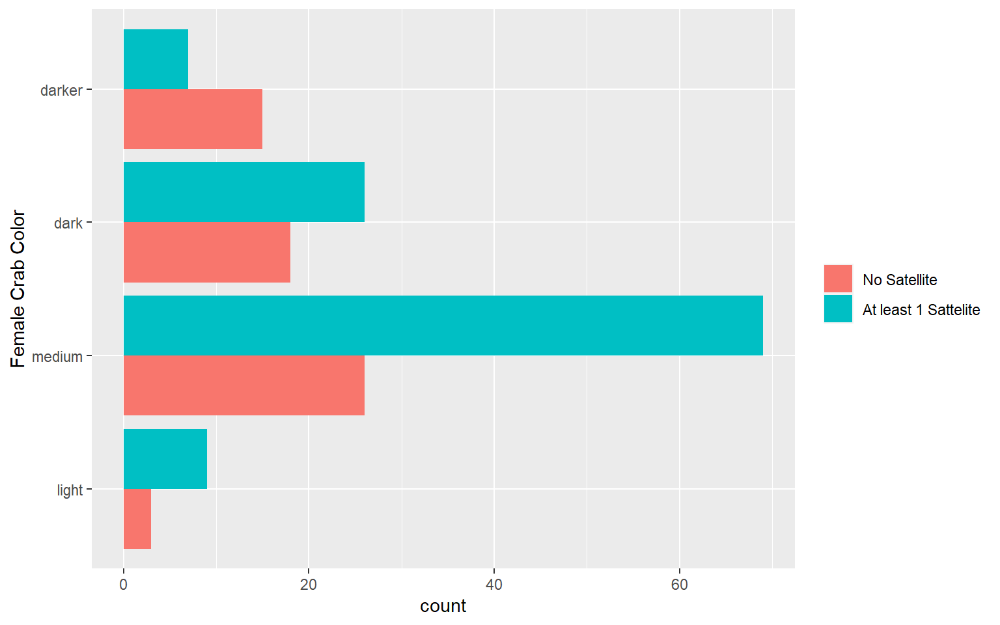
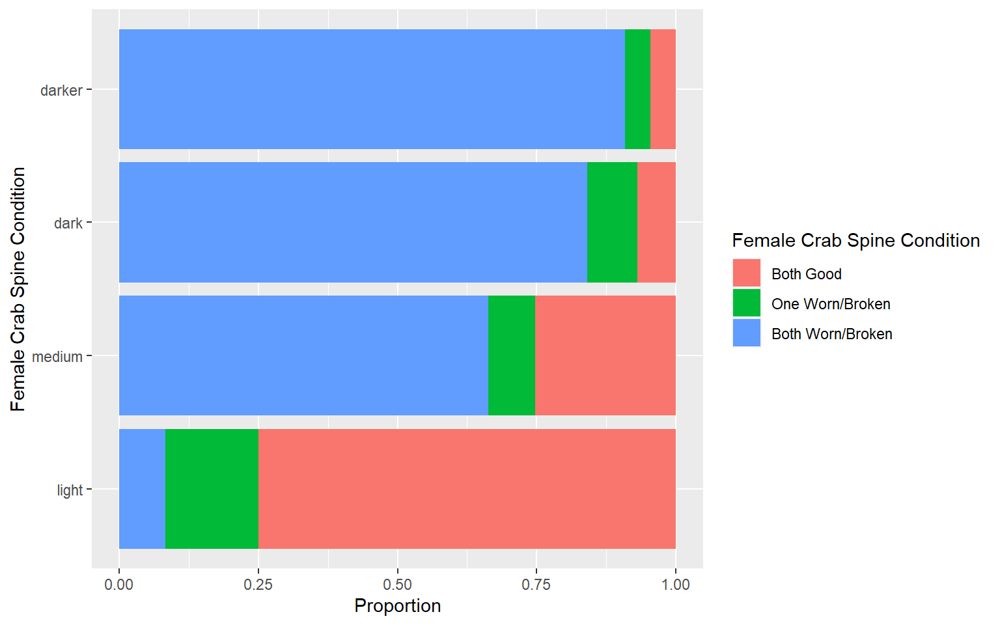
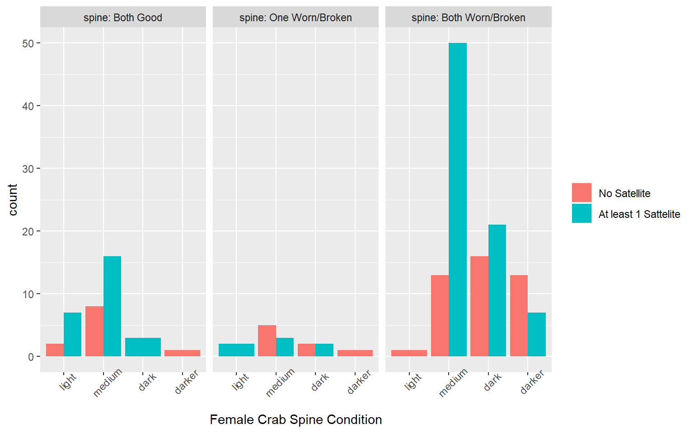
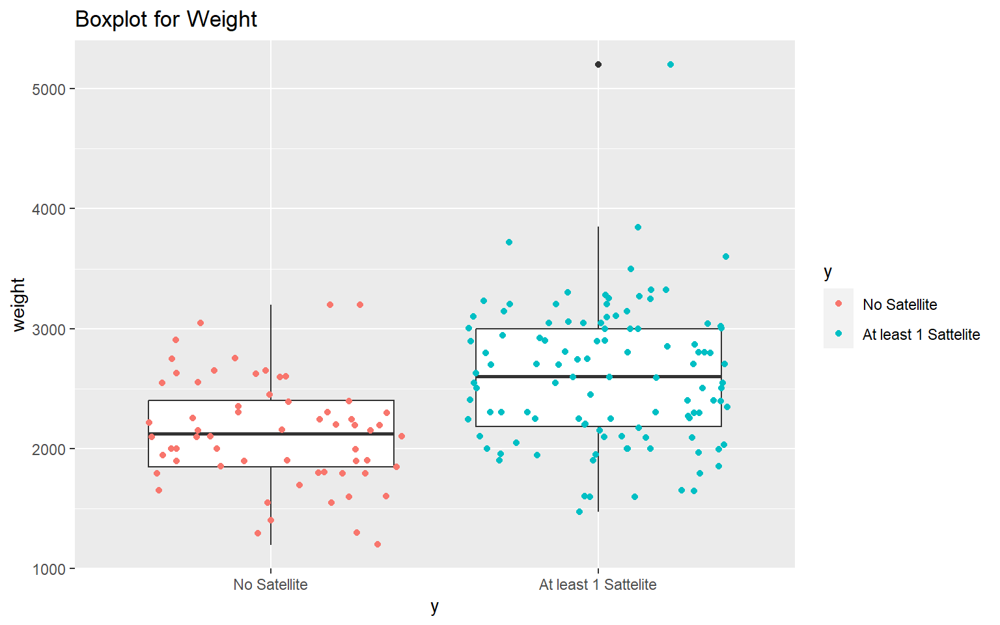
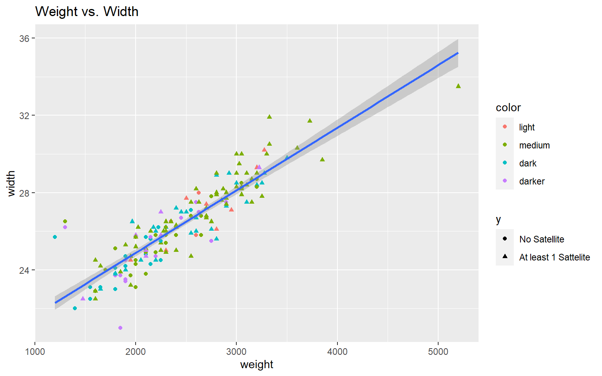

# Horseshoe Crab: An Exploratory Data Analysis

Summarize the horseshoe crab data numerically and graphically. Perform exploratory data analysis (EDA) to identify general patterns in the data.

[Project report](https://rpubs.com/clh2021/1119541)

Key features:

- Exploratory Data Analysis (EDA)
- Numerical Summaries and Contingency Tables
- Correlation Analysis
- Bar Plot, Box Plot, Scatter Plot
- Linear Regression

R packages used:

- `here`: enables easy file referencing and builds file paths in a OS-independent way
- `stats`: loads this before loading `tidyverse` to avoid masking some `tidyverse` functions
- `tidyverse`: includes collections of useful packages like `dplyr` (data manipulation), `tidyr` (tidying data),  `ggplots` (creating graphs), etc.
- `glue`: offers interpreted string literals for easy creation of dynamic messages and labels

## Project Report

[Project report](https://rpubs.com/clh2021/1119541) ([Github Markdown](./Horseshoe_Crab_EDA.md)) ([R Markdown](./Horseshoe_Crab_EDA.html))

Chien-Lan Hsueh (chienlan.hsueh at gmail.com)

## Overview and Project Goal

In this project, we perform exploratory data analysis (EDA) to identify general patterns in the Horseshoe Crab data by looking at the crabs' sizes (length and weight). 

## Workflow

- Load packages and read in data
- Contingency tables
- Side-by-side bar plots
- Summary statistics
- Box plots
- Correlation and Scatter plot

